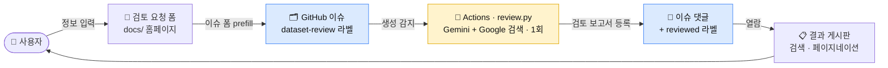
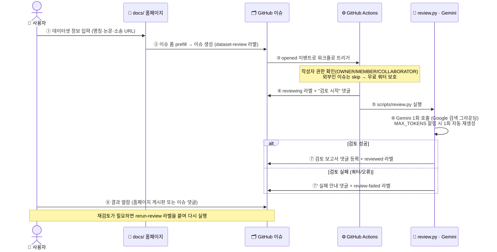

# 🛡️ 오픈 데이터셋 법적 리스크 검토 에이전트

오픈 데이터셋의 **라이선스 · 데이터 생성/수집 방식 · 개인정보 포함 여부**를 자동으로 검토하여
GitHub 이슈에 검토 결과를 등록하는 프로젝트입니다.

> 본 검토는 **회사 내부의 사전 리스크 검토용 참고 자료**이며, 법률 자문이나 법적 판단을 대체하지 않습니다.

## 🧩 한눈에 보기

**사용자 입력 → GitHub 이슈 → 자동 검토(Gemini) → 결과 열람** 이 하나의 서버리스 파이프라인으로 연결됩니다.



| 컴포넌트 | 역할 | 한 줄 설명 |
| --- | --- | --- |
| [`docs/`](docs/) | 🖥️ 입력·열람 | 검토 요청 폼 + 결과 게시판(검색·페이지네이션·낮밤 테마·접근 암호 게이트) |
| [`.github/ISSUE_TEMPLATE/`](.github/ISSUE_TEMPLATE/dataset-review.yml) | 📨 접수 | 홈페이지가 prefill 하는 검토 요청 이슈 폼 |
| [`.github/workflows/`](.github/workflows/dataset-review.yml) | ⚙️ 자동화 | 이슈 감지 → 검토 실행 → 결과 댓글·라벨 처리(무료 쿼터 보호 포함) |
| [`scripts/review.py`](scripts/review.py) + [`system_prompt.md`](scripts/system_prompt.md) | 🤖 검토 엔진 | Gemini(구글 검색 그라운딩) **1회 호출**로 라이선스·수집방식·개인정보·소송 리스크 분석 |

## 🔄 데이터 흐름 (Data Flow)

이슈 하나가 생성되어 검토 결과가 등록되기까지의 상호작용 순서입니다.



> **핵심 원칙**: *검토는 자동, 최종 판단의 책임은 사람.* 본 검토는 참고 자료이며 법률 자문을
> 대체하지 않습니다. 무료 티어 보호를 위해 검토 1건당 Gemini 호출은 **정확히 1회**이고, 실패는
> `review-failed` 라벨로 명확히 표시되며 재검토는 `rerun-review` 라벨로만 실행됩니다.

## 동작 방식

위 파이프라인의 특징은 다음과 같습니다.

- **백엔드 서버 없음**: 정적 홈페이지 + GitHub 이슈 폼 + GitHub Actions로만 동작합니다.
- **API 키 노출 없음**: Gemini API 키는 GitHub Secrets에만 저장됩니다.
- **완전 무료**: GitHub Pages / Actions 무료 티어 + Google AI Studio 무료 API.
- **AI 호출 최소화 설계**: 검토 1건당 Gemini 호출은 **정확히 1회**이며, 그 외 모든 기능
  (이슈 파싱, 보고서 정리, 인용 링크, 결과 목록 등)은 AI 없이 일반 코드로 동작합니다.
  → 자세한 내용은 [무료 Gemini API 안정 운영](#-무료-gemini-api-안정-운영-호출-최소화-설계) 참고.
- **논문 기반 분석**: 이슈에 논문 주소(예: `arxiv.org/abs/...`)를 입력하면 Gemini 가 Google
  검색 그라운딩으로 해당 논문과 공식 자료를 찾아 라이선스·데이터 수집 방법을 분석하고, 근거
  문장을 출처와 함께 인용합니다.

## 구성 요소

| 경로 | 설명 |
| --- | --- |
| `docs/` | GitHub Pages로 배포되는 입력 홈페이지 (`index.html`, `app.js`, `style.css`, `config.js`) |
| `.github/ISSUE_TEMPLATE/dataset-review.yml` | 검토 요청 이슈 폼 (홈페이지가 이 폼을 prefill) |
| `.github/workflows/dataset-review.yml` | 이슈 생성 시 검토를 실행하는 GitHub Actions 워크플로 |
| `scripts/review.py` | Gemini 호출 + 검토 보고서 생성 스크립트 |
| `scripts/system_prompt.md` | 법적 리스크 검토 에이전트 시스템 프롬프트(검토 지침) |
| `tools/gemini_api_key_test.sh` | Gemini API 키 동작을 curl 로 확인하는 진단 스크립트 |

## 설정 방법 (1회)

> 아래 1~4단계를 마치면 바로 사용할 수 있습니다. 각 단계 끝의 ✅ 확인 방법으로 검증하세요.

### 1. Google AI Studio API 키 발급
1. <https://aistudio.google.com/apikey> 에서 무료 API 키 발급 (Google 계정만 있으면 무료·카드 등록 불필요)
2. 저장소 **Settings → Secrets and variables → Actions → New repository secret**
   - Name: `GEMINI_API_KEY`
   - Value: 발급받은 키
3. (선택) 모델은 기본값 `gemini-flash-latest`(최신 Flash 자동)로 동작합니다. 버전 고정·변경은
   **Variables** 탭에 `GEMINI_MODEL` 을 추가하세요. → [모델 선택과 무료 한도](#모델-선택과-무료-한도-gemini_model) 참고.

✅ 확인: `./tools/gemini_api_key_test.sh <API_KEY>` 실행 → 초록색 ✓ 가 나오면 키 정상.

### 2. GitHub Pages 활성화
- **Settings → Pages → Source: Deploy from a branch**
- Branch: `main` / 폴더: `/docs` 선택 후 저장
- 배포 URL: `https://<owner>.github.io/<repo>/` (본 저장소: <https://aigovsensing.github.io/dataset-review/>)

✅ 확인: 배포 URL 접속 시 "검토 요청" 입력 폼이 보이면 정상 (반영까지 1~2분 소요).

### 3. Actions 권한 확인
- **Settings → Actions → General → Workflow permissions**
- **Read and write permissions** 활성화 (이슈에 댓글/라벨을 달기 위해 필요)

### 4. 라벨 생성 (필수) ⚠️
> **중요:** 이슈 폼 템플릿은 저장소에 **이미 존재하는 라벨만** 자동 적용합니다.
> `dataset-review` 라벨이 저장소에 없으면 검토 요청 이슈에 라벨이 붙지 않아 워크플로가
> `Skipped` 됩니다. 아래 라벨을 **미리 생성**해 두어야 합니다.

`gh` CLI로 한 번에 생성:
```bash
R=<owner>/<repo>
gh label create dataset-review --repo $R --color 1d76db --description "검토 요청 (트리거)" --force
gh label create reviewing      --repo $R --color fbca04 --description "검토 진행 중" --force
gh label create reviewed       --repo $R --color 0e8a16 --description "검토 완료" --force
gh label create review-failed  --repo $R --color d73a4a --description "검토 실패" --force
gh label create rerun-review   --repo $R --color 5319e7 --description "재검토 강제 실행" --force
```

✅ 확인: 저장소 **Issues → Labels** 에 위 5개 라벨이 보이면 정상.

### 5. 접근 암호 설정 (선택, 약한 게이트)

홈페이지에 아무나 접속하지 못하도록 최소한의 접근 암호를 걸 수 있습니다.
기본 암호는 `guest2848` 입니다. 암호를 바꾸려면 SHA-256 해시를 계산해 `docs/config.js` 의
`authHash` 값을 교체하세요.

```bash
printf '%s' '새암호' | sha256sum   # 출력된 해시를 docs/config.js 의 authHash 에 붙여넣기
```

- 게이트를 끄려면 `authHash` 를 `""` 로 둡니다.
- 인증되면 해당 브라우저(`localStorage`)에 기억되어 다시 묻지 않습니다.
- ⚠️ **이것은 실제 보안이 아닙니다.** 정적 페이지 특성상 소스(해시)가 공개되므로
  마음먹은 사용자는 우회할 수 있는 **단순 차단 장치**입니다. 민감 정보 보호 용도로는
  부적합하며, "아무나 우연히 접속" 을 막는 정도로만 사용하세요. (검토 내용 자체는 GitHub
  이슈에 있고, 결과 목록도 GitHub API 로 조회되므로 이 게이트로 보호되지 않습니다.)

### 6. 다른 저장소로 재배포하는 경우
- 이 저장소를 Fork(또는 Use this template)한 뒤, `docs/config.js` 의 `owner` / `repo` 값을 수정합니다.
- 위 1~4번(API 키 Secret, Pages, Actions 권한, 라벨 생성)을 새 저장소에서도 수행합니다.

## 사용 방법

1. **검토 요청** — 홈페이지(GitHub Pages)의 **검토 요청** 탭에서 데이터셋 명칭(필수)과
   논문 주소, 공식 홈페이지, 관련 소송 URL 등을 입력하고 **"검토 요청 (GitHub 이슈 생성)"**
   버튼을 누릅니다. 폼 내용이 미리 채워진 GitHub 이슈 작성 페이지가 열리며, 여기서
   **Create issue** 를 눌러야 이슈가 실제로 생성됩니다. (GitHub 로그인 필요)
2. **자동 검토** — 이슈가 생성되면 GitHub Actions 가 즉시 실행됩니다. 별도의 승인 절차는
   없으며, 보통 1~3분 뒤 검토 보고서가 이슈 댓글로 등록되고 `reviewed` 라벨이 붙습니다.
   - ⚠️ 단, **이슈 작성자가 저장소 소유자/멤버/협력자(collaborator)** 인 경우에만 검토가
     실행됩니다(무료 API 쿼터 보호). 외부 사용자의 이슈는 자동으로 건너뜁니다.
3. **결과 열람** — 홈페이지의 **검토 결과** 탭 또는 GitHub 이슈에서 직접 확인합니다.
   보고서 최상단의 **종합의견**은 요청자에게 그대로 복사·회신할 수 있는 요약문입니다.
   - 🔍 **검색**: 데이터셋 명칭·제목으로 목록을 필터링할 수 있습니다.
   - 📄 **게시판/페이지네이션**: 기본 한 페이지 10건씩 보이며, **페이지당 개수**를
     5·10·15·20·30·50·100 중에서 고르고 이전/다음으로 페이지를 넘길 수 있습니다.
4. **재검토** — 입력을 수정했거나 결과가 미흡하면 이슈에 `rerun-review` 라벨을 붙이세요.
   해당 이슈만 다시 검토됩니다. (Gemini 호출이 1회 추가되므로 필요할 때만 사용)

### 입력 팁: 논문·공식 URL 을 함께 입력하면 정확도가 올라갑니다

논문 주소(예: `https://arxiv.org/abs/xxxx.xxxxx`), 공식 홈페이지, LICENSE/Terms, GitHub·
Hugging Face 주소를 입력하면 Gemini 가 Google 검색 그라운딩으로 그 자료들을 우선적으로
찾아 라이선스 조항·데이터 수집 방법·개인정보 처리 서술을 원문 근거와 함께 인용합니다.
URL 이 구체적일수록 검토 품질이 올라갑니다. 여러 개는 줄바꿈으로 구분해 입력합니다.

### 논문 주소(arXiv)는 어떻게 분석되나?

> **결론부터**: 코드가 arXiv PDF 를 직접 다운로드·파싱하지는 **않습니다.** 그 URL 을 Gemini 에
> 넘겨, **Gemini 가 Google 검색 그라운딩으로 논문을 찾아 분석·인용**하도록 되어 있습니다.

**처리 흐름 (arXiv 주소 입력 시)**

1. **폼에서 URL 추출 (코드, AI 아님)** — [`parse_issue_body()`](scripts/review.py#L31)가 이슈 본문의
   `### 논문 주소 (URL)` 섹션을 정규식으로 파싱해 `fields["paper_urls"]` 에 담습니다.
2. **프롬프트에 URL 그대로 삽입** — [`build_user_prompt()`](scripts/review.py#L82):
   ```python
   if fields.get("paper_urls"):
       lines.append(f"- 논문 주소: {fields['paper_urls']}")
   ```
   arXiv 전용 처리(PDF 변환·다운로드)는 없습니다. URL 을 텍스트로 넣고, "Google 검색 도구로 논문 등
   공식 자료를 직접 확인 · 이 URL 을 우선 근거로 활용 · 인용 시 출처 URL 함께 제시"라고 지시합니다.
3. **시스템 지침이 논문 활용 방식을 규정** — [`system_prompt.md`](scripts/system_prompt.md#L27):
   *"논문·공식 홈페이지·LICENSE… URL 이 제공되면 Google 검색 도구로 해당 자료를 우선적으로 찾아,
   라이선스 조항·데이터 수집 방법(크롤링·출처·필터링)·개인정보 서술을 원문에서 확인하고 그 문장을
   그대로 인용한다."* → 논문에서 **라이선스 / 데이터 수집 방식 / 개인정보** 3대 항목의 근거를 찾습니다.
4. **Gemini 1회 호출 (google_search 그라운딩)** — [`review.py`](scripts/review.py#L478):
   ```python
   tools = [types.Tool(google_search=types.GoogleSearch())]
   ```
   Gemini 가 이 도구로 arXiv 논문(및 관련 공식 자료)을 **실제 검색·열람해 분석**합니다. 논문 내용을
   이해하는 "분석"은 여기서 일어납니다.
5. **후처리로 인용을 링크화 (코드, AI 아님)** — Gemini 가 근거 문장 끝에 `[cite: N]` 을 붙이면
   ([`system_prompt.md`](scripts/system_prompt.md#L54)), `linkify_citations()` 가 그 번호를 실제
   출처 URL 링크로 변환하고 그라운딩 출처 목록을 결과 하단에 첨부합니다.

**참고 (이력):** 과거 두 방식을 시도했다가 무료 티어 안정성 문제로 되돌렸습니다.
- `url_context` 도구(모델이 PDF 원문을 직접 읽기) → 대용량 논문 PDF 에서 **빈 응답 실패**
- arXiv API 로 초록을 코드로 가져와 주입 → 모델이 초록을 출력에 되풀이하는 **무한 반복 루프**

그래서 현재는 가장 안정적인 **google_search 그라운딩 단독** 방식입니다. 정리하면 — arXiv URL 은
"Gemini 에게 이 논문을 찾아 근거로 쓰라"는 **지시의 입력**으로 쓰이고, 실제 논문 읽기·분석은
Gemini 의 Google 검색 그라운딩이 수행하며, 코드는 그 앞뒤(URL 추출·인용 링크화·출처 첨부)를 담당합니다.

## 라벨

| 라벨 | 의미 |
| --- | --- |
| `dataset-review` | 검토 요청 이슈 (트리거). **사전 생성 필요** — 이슈 폼이 이 라벨을 부여 |
| `reviewing` | 검토 진행 중 (워크플로가 자동 부여/제거) |
| `reviewed` | 검토 완료 (워크플로가 자동 부여) |
| `review-failed` | 검토 실패 — API 키/쿼터 등 확인 필요 (워크플로가 자동 부여) |
| `rerun-review` | 이 라벨을 추가하면 재검토를 강제 실행 |
| `review-approved` | **외부(비멤버) 작성자 이슈 승인** — 멤버가 이 라벨을 붙이면 작성자 권한과 무관하게 검토 실행 |

## 💰 무료 Gemini API 안정 운영 (호출 최소화 설계)

이 프로젝트는 **Google AI Studio 무료 API 키**로 운영되는 것을 전제로 설계되었습니다.
핵심 원칙은 두 가지입니다.

1. **검토 1건 = Gemini API 호출 정확히 1회.** 그 이상은 어떤 경로로도 발생하지 않습니다.
2. **AI 없이 구현 가능한 기능은 전부 일반 코드로 구현.** Gemini 는 오직 "법적 리스크 판단"
   한 곳에만 사용합니다.

### AI 를 쓰지 않는 부분 (일반 코드로 구현된 기능)

| 기능 | 구현 위치 | 방식 |
| --- | --- | --- |
| 이슈 폼 파싱 (명칭·URL 추출) | `scripts/review.py` `parse_issue_body()` | 정규식 |
| 입력 사전 검증 (빈 이슈 차단) | `scripts/review.py` `run_review()` | 필드 검사 — 검토할 정보가 없으면 **API 호출 없이** 즉시 실패 처리 |
| 인용 번호 → 출처 링크 변환 | `scripts/review.py` `linkify_citations()` | 정규식 |
| 보고서 재구성 (배지·접이식 섹션) | `scripts/review.py` `restructure_review()` | 문자열 처리 |
| 판정(✅/⚠️/⛔) 추출·배너 생성 | `scripts/review.py` `detect_verdict()` | 패턴 매칭 |
| 검토 결과 목록·홈페이지 | `docs/` | 정적 페이지 + GitHub REST API (Gemini 무관) |
| 라벨 관리·댓글 등록 | 워크플로 | `gh` CLI (Gemini 무관) |

### 호출 횟수를 줄이는 장치

- **트리거 권한 제한 (핵심):** 이슈 작성자가 저장소 `OWNER` / `MEMBER` / `COLLABORATOR`
  인 경우에만 검토를 실행합니다(`author_association` 검사). 외부인(`NONE`)이 이슈를 열어도
  검토(=Gemini 호출)가 실행되지 않습니다.
  - **외부인 이슈 승인:** 멤버가 해당 이슈에 **`review-approved`** 라벨을 붙이면 작성자 권한과
    무관하게 검토가 실행됩니다. 라벨은 write/triage 권한자만 붙일 수 있으므로 승인 게이트 역할을
    합니다. (관리자가 `rerun-review` 만 붙이는 것으로는 외부인 이슈가 실행되지 않습니다 — 작성자
    기준 검사이기 때문. 반드시 `review-approved` 를 사용하세요.)
- **이벤트당 정확히 1회 실행:** 이슈 `opened` 시 1회, 이후에는 `rerun-review`(재검토) 또는
  `review-approved`(외부인 승인) 라벨을 붙였을 때만 재실행됩니다. 워크플로가 스스로 붙이는
  `reviewing`/`reviewed` 라벨 이벤트는 실행 조건에서 제외되어 자기 자신을 재트리거하지 않습니다.
- **중복 실행 방지:** `reviewed` 라벨이 붙은 이슈는 재검토되지 않습니다(재검토는 `rerun-review` 라벨로만).
- **동시 실행 직렬화:** `concurrency` 설정으로 같은 이슈의 실행을 직렬화합니다(진행 중인 검토는
  취소하지 않아, 검토가 도중에 끊기지 않습니다).
- **빈 입력 차단:** 데이터셋 명칭과 URL 이 모두 비어 있는 이슈는 Gemini 를 호출하지 않고
  실패 댓글만 남깁니다.
- **일시 오류 재시도 + 모델 자동 폴백:** 503/500 등 일시 서버 오류는 같은 모델로 지수 백오프
  재시도하고, `429`(쿼터 소진)·모델 불가 시에는 무료 쿼터가 더 큰 **다음 모델로 자동 폴백**합니다
  (아래 [모델 선택](#모델-선택과-무료-한도-gemini_model) 참고).

### 모델 선택과 무료 한도 (`GEMINI_MODEL`)

기본값은 **`gemini-flash-latest`** — 항상 최신 Flash 로 자동 실행되어 검토 품질을 확보합니다
(현재 → **`gemini-3.5-flash`** 로 해석). 실제 사용된 버전은 검토 결과 **최상단 `모델 정보`** 줄에
표시됩니다. 버전을 바꾸려면 저장소 **Variables** 탭에 `GEMINI_MODEL` 을 지정하세요.
검토 1건 = 호출 1회이므로 **하루 검토 가능 건수 ≈ 모델의 일일 요청 한도(RPD)** 입니다.

> ✅ **모델 자동 폴백**: 무료 티어 일일 쿼터는 **모델별로 분리**됩니다. 그래서 기본 모델이
> `429`(쿼터 소진)이거나 사용 불가하면 **다음 모델로 자동 폴백**해 검토를 계속합니다 —
> 기본 체인은 **`gemini-flash-latest`(→3.5) → `gemini-2.5-flash` → `gemini-2.5-flash-lite`**.
> 폴백이 일어나면 결과 상단 `모델 정보` 에 실제 사용된 모델이 표시됩니다.
> (체인은 `GEMINI_MODEL_FALLBACKS` 변수로 커스터마이즈 가능. 예: `gemini-2.5-flash,gemini-2.0-flash`)

| `GEMINI_MODEL` 설정 | 실제 모델 | 무료 일일 한도(RPD)\* | 권장 상황 |
| --- | --- | --- | --- |
| (미설정) `gemini-flash-latest` | 현재 `gemini-3.5-flash` | 작음 | **품질 우선** — 자동 최신 (기본값) |
| `gemini-3.5-flash` | 3.5 Flash | 작음 (기본값과 동일) | 최신 버전을 **고정**만 하고 싶을 때 (쿼터 이득 없음) |
| `gemini-2.5-flash` | 2.5 Flash | 중간 (~250) | 3.5 시도 없이 **바로 2.5 로 고정** 검토 |
| `gemini-2.5-flash-lite` | 2.5 Flash-Lite | 큼 (~1,000) | 검토량이 많을 때 (품질은 다소 낮음) |
| `gemini-2.5-pro` | 2.5 Pro | 작음 (~100) | 가장 정밀하지만 한도가 작음 |

\* 한도는 수시로 변동됩니다 — [공식 rate limits](https://ai.google.dev/gemini-api/docs/rate-limits) 확인.

- **대부분은 그대로 두면 됩니다.** 최신 3.5 Flash 로 검토하고, 3.5 쿼터가 소진되면 자동으로
  2.5 Flash → 2.5 Flash-Lite 로 폴백하므로 하루 검토 가능량이 크게 늘어납니다.
- **처음부터 2.5 Flash 로 검토**하고 싶으면(3.5 쿼터 시도 자체를 건너뛰려면) `GEMINI_MODEL` 을
  `gemini-2.5-flash` 로 고정하세요. (`rerun-review` 는 호출을 1회 더 소모하며, 실패 대처는
  [트러블슈팅](#review-failed-라벨이-붙은-경우) 참고)

> ⚠️ 저장소 설정의 **"Allow GitHub Actions to create and approve pull requests"** 옵션은
> `GITHUB_TOKEN` 의 PR 권한만 제어하며 **워크플로 실행 횟수·Gemini 호출과 무관**합니다(쿼터 보호 효과 없음).

### 💵 예상 AI API 비용 (검토 요청 횟수별)

> 이 앱은 기본적으로 **Google AI Studio 무료 티어**로 동작하므로 **실제 비용은 $0** 입니다(일일·분당
> 요청 한도 내). 아래 유료 비용은 무료 한도를 초과해 **유료 티어로 전환할 경우의 참고 추정치**입니다.
> 요금은 수시로 변동되니 반드시 [공식 요금 페이지](https://ai.google.dev/gemini-api/docs/pricing)를
> 확인하세요. **(기준: 2026-07)**

- **호출 구조**: 홈페이지에서 **"검토 요청 (GitHub 이슈 생성)" 1건 = Gemini `generateContent` 1회 호출**
  (+ Google 검색 그라운딩 1회). 출력이 토큰 한도로 잘리면 자동으로 **1회 재생성**하므로 드물게 2회가 됩니다.
- **검토 1건당 토큰(실측 대략)**: 입력 ~5K tokens, 출력(사고 포함) ~8K tokens. 데이터셋·논문·소송 입력
  복잡도에 따라 달라집니다.

#### ① 모델별 검토 1건당 단가 (유료 티어)

| 모델 (`GEMINI_MODEL`) | 입력 단가 | 출력 단가 | 검토 1건 토큰 비용\* | 그라운딩(무료 한도 초과 시) |
| --- | --- | --- | --- | --- |
| `gemini-flash-latest` (**기본값**) | 해석 버전 따름 | 해석 버전 따름 | 현재 → `gemini-3.5-flash` = **≈ $0.08** | 현재 3.x = +$0.014/건 (월 5,000건 무료 후) |
| `gemini-3.5-flash` | $1.50 / 1M | $9.00 / 1M | **≈ $0.08** | +$0.014/건 (월 5,000건 무료 후) |
| `gemini-2.5-flash` | $0.30 / 1M | $2.50 / 1M | **≈ $0.02** | +$0.035/건 (일 1,500건 무료 후) |
| `gemini-2.5-flash-lite` (최저가) | $0.10 / 1M | $0.40 / 1M | **≈ $0.004** | +$0.035/건 (2.x 공유) |

\* 입력 5K + 출력 8K tokens 가정, 그라운딩 무료 구간 기준. 기본값(→ 3.5 Flash)은 검토 1건 ≈ $0.08,
`gemini-2.5-flash` 로 고정하면 약 1/4, `gemini-2.5-flash-lite` 는 약 1/20 수준입니다
(모델 선택은 [위 섹션](#모델-선택과-무료-한도-gemini_model) 참고).

#### ② 검토 요청 횟수별 예상 비용 (기본값 `gemini-flash-latest` → 현재 `gemini-3.5-flash` 기준)

| 검토 요청 횟수 | 실제 Gemini 호출 횟수 | 무료 티어 비용 | 유료 티어 예상 비용 | 비고 |
| --- | --- | --- | --- | --- |
| 1건 | 1회 (드물게 2회) | **$0** | ≈ $0.08 | 그라운딩 월 5,000건 무료 내 |
| 10건 | ≈ 10회 | **$0** | ≈ $0.8 | |
| 100건 | ≈ 100회 | **$0** | ≈ $8 | |
| 1,000건 | ≈ 1,000회 | $0 (여러 날 분산 시) | ≈ $80 | 무료 일일 한도(RPD) 초과 가능 → 유료 필요 |
| 10,000건 | ≈ 10,000회 | 한도 초과 | ≈ $800 (+그라운딩 초과분) | 월 5,000건 초과분은 그라운딩 $0.014/건 별도 |

> 요금 출처: [Gemini API Pricing (공식)](https://ai.google.dev/gemini-api/docs/pricing) · 그라운딩은
> Gemini 2.x = 일 1,500건 무료 후 $35/1,000건, Gemini 3.x = 월 5,000건 무료 후 $14/1,000건.

## 소송 리스크 검토 (AI 학습 데이터 무단 활용)

데이터셋이 AI 학습 데이터 무단 활용 소송의 대상인 경우, 검토 요청 시
**관련 소송(CourtListener 등) URL** 을 함께 입력할 수 있습니다. 입력하면 검토 결과에
`3. 소송 리스크` 섹션이 추가되어 다음을 정리합니다.

- **원고가 침해를 어떻게 입증했는가**를 근거 강도 **강 / 중 / 약** 으로 분류
  - **강(强)** — 피고의 논문·법정 문서 자인, 법원 사실인정·디스커버리
  - **중(中)** — 제3자 조사, 모델 자기 진술, "on information and belief" 등 논증적 추론
  - **약(弱)** — 명칭만 언급, 본문 근거 부재
- 근거가 된 **소장 원문 문장 직접 인용 + 항 번호** 표기 후 한국어 요약

## 알려진 이슈 / 트러블슈팅

### 이슈를 만들었는데 검토가 실행되지 않는 경우

Actions 탭에서 워크플로가 `Skipped` 라면 실행 조건 미충족입니다. 순서대로 확인하세요.

1. **이슈에 `dataset-review` 라벨이 있는가?** — 없다면 저장소에 라벨이 미리 생성되지 않은
   것입니다. [설정 4번](#4-라벨-생성-필수-)으로 라벨을 만들고, 기존 이슈에 라벨을 수동으로
   붙인 뒤 `rerun-review` 라벨을 추가하세요.
2. **이슈 작성자가 소유자/멤버/협력자인가?** — 외부 사용자(`NONE`)의 이슈는 쿼터 보호를 위해
   자동 실행되지 않습니다(작성자 기준). 이 경우 **멤버가 이슈에 `review-approved` 라벨을 붙이면**
   승인·실행됩니다. (단순 `rerun-review` 로는 외부인 이슈가 실행되지 않으니 `review-approved` 를 쓰세요.)
3. 워크플로가 실행됐는데 실패했다면 이슈의 오류 댓글과 Actions 로그를 확인하세요.

### `review-failed` 라벨이 붙은 경우

이슈의 오류 댓글에서 원인을 확인할 수 있습니다.

| 오류 메시지 | 원인 | 조치 |
| --- | --- | --- |
| `GEMINI_API_KEY 환경 변수가 설정되어 있지 않습니다` | Secret 미등록 | 설정 1번 수행 |
| `429` / `RESOURCE_EXHAUSTED` | **폴백 체인의 모든 모델**까지 일일 한도 소진 | 다음 날 `rerun-review` (또는 `GEMINI_MODEL_FALLBACKS` 확장) |
| `503` / `high demand` (재시도 후에도 실패) | Google 서버 혼잡 | 잠시 후 `rerun-review` |
| `검토할 데이터셋 정보가 없습니다` | 이슈 폼이 비어 있음 | 이슈 본문 수정 후 `rerun-review` |
| `Gemini 응답이 비어 있습니다` | 모델이 답변 없이 종료 | `rerun-review` 로 재시도 |

### "검토 결과" 목록에 `GitHub API 403` 이 표시되는 경우 ⚠️ (운영 필독)

홈페이지의 **검토 결과** 탭 목록은 브라우저에서 **비인증(토큰 없이)** GitHub REST API를 호출합니다.
비인증 요청은 **IP당 시간당 60회**로 제한됩니다.

- 결정적으로, **회사 프록시/NAT 때문에 사내 모든 사용자가 같은 공용 IP를 공유**합니다.
  그래서 60회/시간 한도가 **사무실 전체에서 순식간에 소진되어 403(rate limit exceeded)** 이 발생합니다.
- 인증을 붙이면(시간당 5,000회) 해결되지만, 그러려면 **토큰을 브라우저에 노출**해야 하므로
  보안상 부적절합니다. 따라서 인증은 적용하지 않습니다.

이는 코드 버그가 아니라 GitHub의 정상적인 비인증 API 한도이며, 공용 IP 환경 특성상 자주 발생합니다.
대신 다음과 같이 견고하게 처리합니다.

- **한도 초과를 명확히 안내** — 원인과 **리셋 예상 시각**(`X-RateLimit-Reset`)을 표시
- **마지막 목록 캐시** — 마지막으로 성공한 목록을 `localStorage` 에 저장해 실패 시 "최신이 아닐 수 있음"
  표기와 함께 보여줌
- **GitHub 이슈 페이지 직접 링크** 제공 — 웹 이슈 페이지는 API 한도와 무관하므로 언제든 조회 가능

> **대처:** 목록이 안 보이면 잠시(최대 1시간, 리셋 시각까지) 기다리거나, "GitHub에서 이슈 보기" 링크로
> 직접 확인하세요. 상세 검토 결과(이슈 댓글)는 이 한도와 무관하게 항상 열람할 수 있습니다.

#### 선택: 본인 GitHub 토큰으로 한도 올리기 (60 → 5,000회/시간)

검토 결과 탭의 **🔑 인증** 버튼(한도 초과 시 자동으로 열림)에서 본인의 GitHub 토큰을 입력하면
해당 브라우저에서의 목록 조회 한도가 **시간당 5,000회**로 올라갑니다.

- **토큰 생성:** [github.com/settings/tokens/new](https://github.com/settings/tokens/new) —
  공개 저장소 조회에는 **권한(scope)이 필요 없으므로** 스코프를 선택하지 않은(read-only) 토큰이 가장 안전합니다.
- **저장 위치:** 토큰은 **사용자 브라우저의 `localStorage`(`dr_github_token`)에만** 저장되고 GitHub API
  호출의 `Authorization` 헤더로만 사용됩니다. **저장소에 커밋되거나 외부로 전송되지 않습니다.**
- **주의:** 토큰을 브라우저에 두는 것이므로 **공용 PC에서는 사용 후 반드시 "삭제"** 하세요. 잘못된/만료된
  토큰은 401로 안내되며, 다시 입력하거나 삭제할 수 있습니다.
- 이 방식은 개별 사용자가 스스로 선택하는 옵션입니다. 서버나 페이지에 공용 토큰을 심지 않는 이유는,
  정적 페이지에 토큰을 두면 누구나 열람·악용할 수 있어 보안상 부적절하기 때문입니다.

## 로컬 실행 / 테스트

```bash
pip install -r scripts/requirements.txt
export GEMINI_API_KEY=...           # AI Studio 키
export ISSUE_TITLE="[검토] CelebA"
export ISSUE_BODY="### 데이터셋 명칭

CelebA

### 공식 홈페이지 / 저장소 URL

https://mmlab.ie.cuhk.edu.hk/projects/CelebA.html"
python scripts/review.py            # review.md 생성
```

## 참고

- 검토 지침(시스템 프롬프트)은 `scripts/system_prompt.md` 에서 수정할 수 있습니다.
- Gemini의 Google 검색 그라운딩을 사용하므로 검토 결과에는 참조한 공식 출처 URL이 함께 첨부됩니다.
- Actions 로그의 `[diag] finish_reason=... prompt=... output=...` 줄에서 토큰 사용량과 종료 사유를
  확인할 수 있어, 응답이 비거나 잘릴 때 원인을 진단할 수 있습니다.
- API 키 동작 확인은 `tools/gemini_api_key_test.sh` 로 테스트할 수 있습니다.
- 검토 결과 맨 위에는 요청자에게 바로 복사·회신할 수 있는 **`종합의견`**(라이선스·수집방법·개인정보
  3줄 요약 + 리스크 결론)이 표시되며, 상세 분석은 그 아래 접이식 섹션으로 정리됩니다.

## 라이선스

이 프로젝트는 [Apache License 2.0](LICENSE) 하에 배포됩니다.

> 🍺 **The Beer Clause (선택 사항, 법적 효력 없음):**
> 이 프로젝트가 마음에 들고 언젠가 제작자를 만나게 된다면, 맥주 한잔 사주셔도 좋습니다.
> 물론 의무는 아닙니다 — 정식 라이선스는 위의 Apache 2.0 입니다. 🍻
> _("법적 리스크 검토" 도구가 법적으로 모호한 Beerware를 쓸 수는 없어, 안전한 Apache 2.0 에 재미만 얹었습니다.)_
