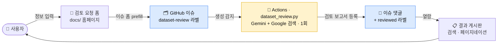
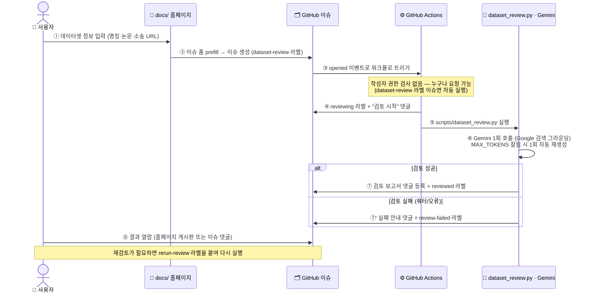
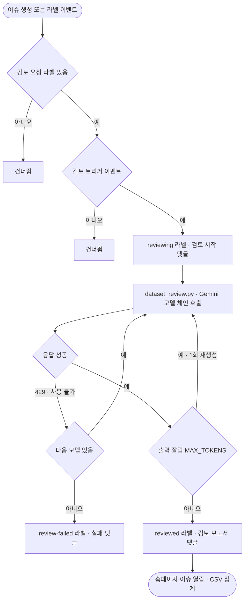

[← README](../README.md)

# 구조와 동작 (Architecture)

문서: **architecture** · [setup](setup.md) · [usage](usage.md) · [models-and-quota](models-and-quota.md) · [litigation](litigation.md) · [troubleshooting](troubleshooting.md) · [development](development.md)

---

## 🧩 한눈에 보기

**사용자 입력 → GitHub 이슈 → 자동 검토(Gemini) → 결과 열람** 이 하나의 서버리스 파이프라인으로 연결됩니다.

| 컴포넌트 | 역할 | 한 줄 설명 |
| --- | --- | --- |
| [`docs/`](../docs/) | 🖥️ 입력·열람 | 검토 요청 폼 + 결과 게시판(검색·페이지네이션·낮밤 테마·접근 암호 게이트) |
| [`.github/ISSUE_TEMPLATE/`](../.github/ISSUE_TEMPLATE/dataset-review.yml) | 📨 접수 | 홈페이지가 prefill 하는 검토 요청 이슈 폼 |
| [`.github/workflows/`](../.github/workflows/dataset-review.yml) | ⚙️ 자동화 | 이슈 감지 → 검토 실행 → 결과 댓글·라벨 처리(무료 쿼터 보호 포함) |
| [`scripts/dataset_review.py`](../scripts/dataset_review.py) + [`system_prompt_dataset_review.md`](../prompt-book/system_prompt_dataset_review.md) | 🤖 검토 엔진 | Gemini(구글 검색 그라운딩) **1회 호출**로 라이선스·수집방식·개인정보·소송 리스크 분석 |

## 🔄 데이터 흐름 (Data Flow)

이슈 하나가 생성되어 검토 결과가 등록되기까지의 상호작용 순서입니다.

> **핵심 원칙**: *검토는 자동, 최종 판단의 책임은 사람.* 본 검토는 참고 자료이며 법률 자문을
> 대체하지 않습니다. 무료 티어 보호를 위해 검토 1건당 Gemini 호출은 **정확히 1회**이고, 실패는
> `review-failed` 라벨로 명확히 표시되며 재검토는 `rerun-review` 라벨로만 실행됩니다.

## ⚙️ 동작 흐름 (Operation Flow)

이슈가 생성된 뒤 **어떤 조건·분기로 검토가 실행되는지**(운영 관점)를 나타냅니다.
(컴포넌트 간 상호작용 순서는 위 **데이터 흐름** 시퀀스 다이어그램을 참고하세요.)

- **트리거 판정(누구나 사용 가능)**: ① `dataset-review` 라벨 + ② `opened`(신규)·`rerun-review` 이벤트
  — **둘 다 충족**하면 작성자 권한과 무관하게 검토를 실행합니다. 작성자 권한(`author_association`)
  검사는 하지 않으므로 외부인 이슈도 자동 검토됩니다.
- **모델 폴백**: `gemini-flash-latest` → `gemini-3.7-flash` → `gemini-3.6-flash` → `gemini-3.5-flash` → `gemini-3.5-flash-lite` → `gemini-3.1-flash-lite` → `gemini-2.5-flash` → `gemini-2.5-flash-lite` (품질 우선 → 안정성 하강).
  `429`(쿼터 소진)·사용 불가면 다음 모델로 자동 폴백합니다. 별칭 호출이 실패해도 **최신 세대(`gemini-3.7-flash`/`gemini-3.6-flash`)를 명시적으로 시도**해 2.5 로 내려가기 전 최신 세대를 최대한 유지합니다. 무료 티어에서 **3.x 로 결과를 받으려면** → [하이브리드 2패스](models-and-quota.md#무료로-3x-결과-받기--하이브리드-2패스-gemini_writer_model).
- **잘림 대응**: 출력이 `MAX_TOKENS`로 잘리면 같은 모델로 **1회 재생성**합니다.
- **결과 분기**: 성공 → `reviewed` 라벨 + 검토 보고서 댓글 / 실패(모든 모델 쿼터 소진 등) →
  `review-failed` 라벨 + 실패 댓글(`rerun-review`로 재시도).

### 설계 특징

- **백엔드 서버 없음**: 정적 홈페이지 + GitHub 이슈 폼 + GitHub Actions로만 동작합니다.
- **API 키 노출 없음**: Gemini API 키는 GitHub Secrets에만 저장됩니다.
- **완전 무료**: GitHub Pages / Actions 무료 티어 + Google AI Studio 무료 API.
- **AI 호출 최소화 설계**: 검토 1건당 Gemini 호출은 **정확히 1회**이며, 그 외 모든 기능
  (이슈 파싱, 보고서 정리, 인용 링크, 결과 목록 등)은 AI 없이 일반 코드로 동작합니다.
  → 자세한 내용은 [무료 Gemini API 안정 운영](models-and-quota.md#-무료-gemini-api-안정-운영-호출-최소화-설계) 참고.
- **논문 기반 분석**: 이슈에 논문 주소(예: `arxiv.org/abs/...`)를 입력하면 Gemini 가 Google
  검색 그라운딩으로 해당 논문과 공식 자료를 찾아 라이선스·데이터 수집 방법을 분석하고, 근거
  문장을 출처와 함께 인용합니다.
- **⛔ 자의적 해석 금지 · 문장별 출처**: 법적 리스크 검토이므로 근거 없는 해석·추리를 사실처럼
  쓰지 않습니다. 데이터셋·논문 검토 **양쪽 시스템 프롬프트**에 강제되어 있습니다(아래 원칙 참고).

### ⛔ 자의적 해석 금지 · 문장별 출처 링크 (검토 신뢰성 핵심)

법적 리스크 판단이므로 **출처 없는 자의적 해석·추리 문구를 사실처럼 서술하는 것을 금지**합니다.
이 원칙은 **데이터셋 검토([`system_prompt_dataset_review.md`](../prompt-book/system_prompt_dataset_review.md))와
논문 검토([`system_prompt_paper_review.md`](../prompt-book/system_prompt_paper_review.md)) 프롬프트에 동일하게**
반영되어 있습니다.

- **인용 ≠ 해석**: 큰따옴표(`"..."`) 원문 인용은 **출처(데이터셋 카드·문서·논문 원문)에 그 문장이
  실제로 존재할 때만** 사용합니다. 없는 문구를 지어내 `"…로 명시되어 있습니다"`처럼 쓰지 않으며,
  모델의 종합·추정은 `추정:`으로 **해석임을 명시**합니다.
- **사용자 입력(prompt)은 근거가 아님**: `[prompt]`·"요청에 따르면" 등을 근거로 쓰지 않습니다.
  근거는 오직 Google 검색으로 확인한 공식 자료 URL(또는 논문 원문 위치)입니다.
- **출처에 없으면 지어내지 않음**: 데이터셋 카드/README·논문에 해당 설명이 없거나 비어 있으면
  "공식 설명 없음"이라고 사실 그대로 적고 **"확인 불가"**로 판정합니다.
- **문장 말미 출처 표기**: 각 항목의 `확인 결과`(논문은 `Reason`·`Result`) 등 **사실을 주장하는
  모든 문장 끝에 실제 출처 URL `([출처](URL))`(논문은 위치 `p.N/섹션` 또는 URL)을 표기**합니다.
  뒷받침 출처가 없으면 표기 대신 **"확인 불가"**로 둡니다.
- **검증 불가한 서술은 쓰지 않음**: 공식 출처로 확인되지 않는 내용은 서술 대신 "확인 불가"로 대체합니다.

> 배경: 초기에 모델이 데이터셋 카드에 없는 요약 문구를 인용처럼 서술하거나 `[prompt]`를 근거로
> 표기하는 사례가 있어, 위 규칙을 두 검토 프롬프트에 명시적으로 추가했습니다.

## 구성 요소

| 경로 | 설명 |
| --- | --- |
| `docs/` | GitHub Pages로 배포되는 입력 홈페이지 (`index.html`, `app.js`, `style.css`, `config.js`) |
| `.github/ISSUE_TEMPLATE/dataset-review.yml` | 검토 요청 이슈 폼 (홈페이지가 이 폼을 prefill) |
| `.github/workflows/dataset-review.yml` | 이슈 생성 시 검토를 실행하는 GitHub Actions 워크플로 |
| `.github/workflows/export-reviews.yml` | 검토 결과를 CSV/JSON 으로 집계·커밋하는 워크플로(매일/수동) |
| `scripts/dataset_review.py` | Gemini 호출 + 검토 보고서 생성 스크립트 |
| `scripts/export_dataset_reviews.py` | 검토 결과 이슈를 파싱해 `docs/data/reviews.csv`·`reviews.json` 생성 |
| `prompt-book/system_prompt_dataset_review.md` | 법적 리스크 검토 에이전트 시스템 프롬프트(검토 지침) |
| `tools/gemini_api_key_test.sh` | Gemini API 키 동작을 curl 로 확인하는 진단 스크립트 |
